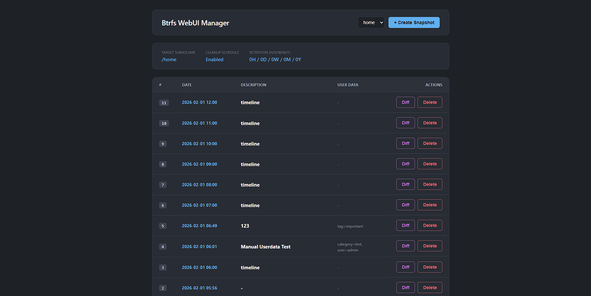

# Btrfs WebUI Manager for NixOS

> **Note:** This project is entirely generated and maintained by **Gemini CLI** under human guidance.



A lightweight, Go-based web interface designed specifically for managing Btrfs snapshots on NixOS via **Snapper**. This project aims to provide a clean, "File Explorer" style dashboard for users who want to visualize their snapshot history and perform granular file restorations without leaving the browser.

## 🚀 Features

*   **Snapshot Browser:** List all snapshots for different Snapper configurations (e.g., `home`, `var`).
*   **Diff Explorer:** A tree-view file diff that allows you to see exactly what changed in each snapshot.
*   **Recursive UndoChange:** Restore specific files or entire directories to a previous state with a single click.
*   **Snapshot Management:** Create new manual snapshots with descriptions and custom userdata, or delete old ones.
*   **System Awareness:** Real-time monitoring of Snapper config settings, cleanup schedules, and retention policies.

## 🛠 Why No "Rollback"?

Unlike `snapper rollback`, this tool focuses on `undochange`. On **NixOS**, system-level rollbacks are traditionally handled via the bootloader generations. 

Performing a Btrfs-level `rollback` (changing the default subvolume) on NixOS can lead to inconsistencies with `fstab` and the Nix store. To keep your system safe and "Nix-idiomatic," we recommend:
1.  Using **Nix Generations** for full system rollbacks.
2.  Using this **WebUI (UndoChange)** for granular data and configuration file recovery.

## 📋 Requirements

To run this WebUI, your system must meet the following criteria:
*   **Operating System:** NixOS (Flake-based recommended).
*   **Filesystem:** Btrfs.
*   **Core Utility:** `snapper` must be installed and active (the WebUI calls `/run/current-system/sw/bin/snapper`).
*   **Permissions:** The service must run as `root` to execute snapshot operations.

## 📦 Installation & Service Configuration

### 1. Flake Input
Add this repo to your `flake.nix` inputs:

```nix
{
  inputs = {
    nixpkgs.url = "github:nixos/nixpkgs/nixos-25.11";
    btrfs-webui.url = "github:anton1615/Btrfs-Webui-for-Nixos";
    # Ensure it uses your system's nixpkgs version to save space
    btrfs-webui.inputs.nixpkgs.follows = "nixpkgs";
  };
  # ...
}
```

### 2. Systemd Service Declaration
In your `configuration.nix` (or any imported module), define the system package and the service. 

**Note:** The service binds to **Port 8888** by default.

```nix
{ config, pkgs, inputs, ... }: {
  # 1. Install the package
  environment.systemPackages = [ 
    inputs.btrfs-webui.packages.${pkgs.system}.default 
  ];
  
  # 2. Define the service
  systemd.services.btrfs-webui = {
    description = "Btrfs Snapshot Web Dashboard";
    after = [ "network.target" ];
    wantedBy = [ "multi-user.target" ];
    serviceConfig = {
      # The binary is named 'Btrfs-Webui-for-Nixos'
      ExecStart = "${inputs.btrfs-webui.packages.${pkgs.system}.default}/bin/Btrfs-Webui-for-Nixos";
      User = "root"; # Required to run 'snapper' commands
      Restart = "always";
    };
  };
}
```

## 🌐 Accessing the WebUI

Once deployed, the service will start automatically.

*   **URL:** `http://localhost:8888`
*   **Port:** `8888` (Hardcoded in `main.go`)
*   **Network:** By default, it listens on all interfaces (`:8888`). If you want to expose it securely, we recommend using **Tailscale Serve** or a reverse proxy.

## ⚙️ Snapper Configuration

This UI **does not** manage Snapper configurations (creating new configs or changing intervals). You should define your Snapper configs in your NixOS configuration using the declarative `services.snapper.configs` option.

## 🧪 Technical Details & Testing Environment

*   **Backend:** Go (Standard Library only).
*   **Frontend:** Pure HTML/JS/CSS (Vanilla, no frameworks, encapsulated via Go `embed`).
*   **Snapper Integration:** Calls `/run/current-system/sw/bin/snapper` directly to ensure NixOS compatibility.
*   **Tested Hardware:** ASUS X550VC (Intel i5-3230M, 4GB RAM).
*   **Tested OS:** NixOS 25.11 (Flake-based).
*   **License:** MIT License.

---
*Developed with ❤️ using Gemini CLI.*
